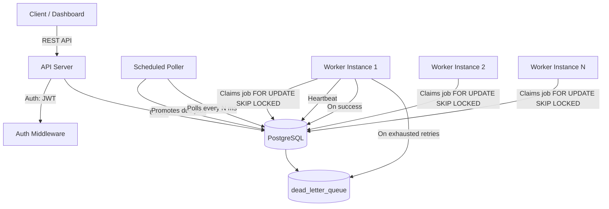

# System Architecture

## Overview

The system is a distributed job scheduler with three independent process types sharing a single PostgreSQL database as the coordination layer — no external message broker is required; Postgres row-locking (`FOR UPDATE SKIP LOCKED`) provides atomic job claiming.

## Components



## Process responsibilities

| Process | Responsibility |
|---|---|
| **API Server** | Auth, project/queue/job CRUD, validation, pagination, structured errors |
| **Scheduled Poller** | Periodically scans for `delayed`/`scheduled`/`recurring` jobs whose `run_at` has passed, promotes them to `queued` |
| **Worker(s)** | Poll `queued` jobs, atomically claim one row per poll cycle, execute, report success/failure, send heartbeats |

## Job lifecycle

```
Queued → Claimed → Running → Completed
                        ↓ (failure)
                  Retry (backoff) → Scheduled
                        ↓ (max retries exhausted)
                  Dead Letter Queue
```

Recurring jobs additionally cycle: `Completed → Scheduled` (next occurrence) instead of terminating.

## Concurrency & reliability

- **Atomic claiming:** workers use `SELECT ... FOR UPDATE SKIP LOCKED` so concurrent worker instances never claim the same job twice.
- **Idempotency:** job execution updates are conditioned on current status, preventing double-processing if a worker crashes mid-execution and another picks it up.
- **Graceful shutdown:** workers listen for `SIGINT`/`SIGTERM`, finish in-flight jobs before exiting.
- **Heartbeats:** workers write periodic heartbeat timestamps so stalled/crashed workers can be detected and their claimed jobs reclaimed.

## Scaling considerations

- Multiple worker processes can run against the same DB with no coordination beyond row-level locks.
- Poller is designed to run as a single instance (or with a leader-election lock) to avoid redundant promotion work, though duplicate promotions are harmless since promotion is idempotent (status-conditioned).
