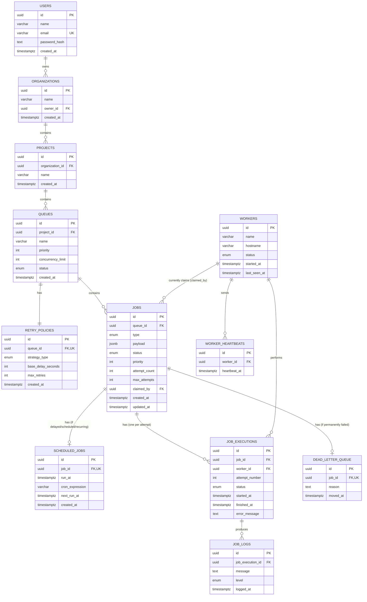

# ER Diagram — Relay (Distributed Job Scheduler)

12 tables, matching `backend/migrations/001_init_schema.sql` exactly.

## Cascading behavior, and why

| Relationship                                       | On delete of parent | Reasoning                                                                                                                                       |
| -------------------------------------------------- | ------------------- | ----------------------------------------------------------------------------------------------------------------------------------------------- |
| `organizations.owner_id → users.id`             | `RESTRICT`        | Can't delete a user while they still own organizations — forces explicit org cleanup first, prevents silent orphaning                          |
| `projects.organization_id → organizations.id`   | `CASCADE`         | A project can't exist without its organization; deleting the org (via`DELETE /organizations/:id`) intentionally removes everything under it   |
| `queues.project_id → projects.id`               | `CASCADE`         | Same reasoning — a queue is meaningless without its project                                                                                    |
| `retry_policies.queue_id → queues.id`           | `CASCADE`         | Retry policy is 1:1 with its queue, has no independent meaning                                                                                  |
| `jobs.queue_id → queues.id`                     | `CASCADE`         | Handled explicitly in application code too (`deleteQueue` deletes jobs first, then the queue, inside one transaction)                         |
| `jobs.claimed_by → workers.id`                  | `SET NULL`        | If a worker process is deregistered/removed, its in-flight job claims shouldn't vanish — they fall back to unclaimed rather than being deleted |
| `scheduled_jobs.job_id → jobs.id`               | `CASCADE`         | Meaningless without the parent job                                                                                                              |
| `job_executions.job_id → jobs.id`               | `CASCADE`         | Execution history belongs entirely to its job                                                                                                   |
| `job_executions.worker_id → workers.id`         | `SET NULL`        | Preserves execution history even after a worker is removed — you don't lose the fact that*a* worker ran this attempt                         |
| `worker_heartbeats.worker_id → workers.id`      | `CASCADE`         | Heartbeat history has no meaning without the worker                                                                                             |
| `job_logs.job_execution_id → job_executions.id` | `CASCADE`         | Logs belong entirely to their execution attempt                                                                                                 |
| `dead_letter_queue.job_id → jobs.id`            | `CASCADE`         | DLQ entry is meaningless without its job                                                                                                        |

## Key indexes and why each exists

- `jobs (queue_id, status, priority DESC)` — the single most-hit query in the system:
  the worker's claim query filters by `status = 'queued'` and orders by priority, every
  ~3 seconds, forever. Without this composite index it's a full table scan under load.
- `jobs (status)` — supports the dashboard's status-filter pills (`GET /jobs?status=`).
- `scheduled_jobs (next_run_at)` — the poller's core query (`WHERE next_run_at <= now()`)
  runs every 5 seconds; this index keeps it fast regardless of table size.
- `job_executions (job_id)` and `(worker_id)` — support the job detail view's execution
  history lookup, and would support a future "jobs run by this worker" view.
- `worker_heartbeats (worker_id, heartbeat_at DESC)` — supports checking a worker's most
  recent heartbeat quickly (used for staleness/dead-worker detection).

## Notes on normalization

Every table stores exactly one kind of fact, with no repeating groups:

- Retry configuration lives once per queue (`retry_policies`), not duplicated onto every job.
- A job's *definition* (`jobs`) is separate from its *schedule* (`scheduled_jobs`) and its
  *run history* (`job_executions`) — three different lifecycles, three different tables.
- `payload` is the one deliberate exception: stored as `JSONB` rather than normalized
  columns, because job payloads are arbitrary and task-specific (an email job and an
  image-resize job need entirely different fields) — normalizing that would mean either a
  sparse table with dozens of nullable columns, or a separate table per job type. JSONB is
  the standard, correct answer for this specific "arbitrary structured data" problem in
  Postgres, and still supports indexing/querying inside the JSON if ever needed.
