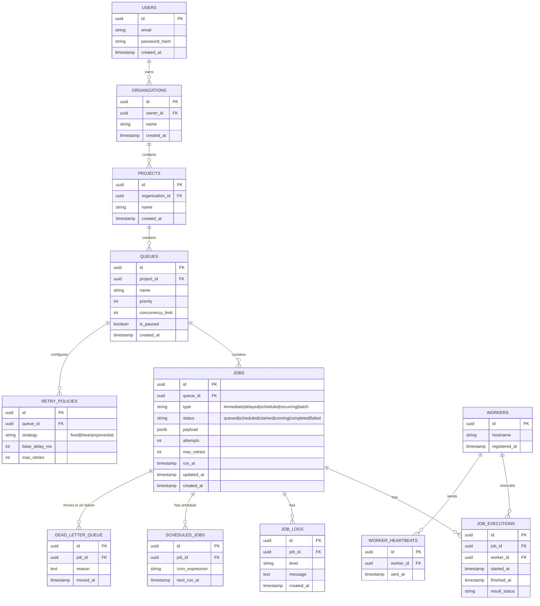

# Entity-Relationship Diagram

## Key design notes

- **Cascading:** deleting a `PROJECT` cascades to its `QUEUES`, which cascades to `JOBS` and `RETRY_POLICIES`. `JOB_EXECUTIONS`, `JOB_LOGS`, and `DEAD_LETTER_QUEUE` rows are retained (soft-referenced or `ON DELETE SET NULL`) for audit purposes rather than cascade-deleted, so history survives job cleanup.
- **Indexes:** composite index on `jobs(status, run_at)` is the critical one — both the poller (`WHERE status IN ('scheduled','delayed') AND run_at <= now()`) and the worker's claim query hit this. Also index `jobs(queue_id, status)` for per-queue stats, and `worker_heartbeats(worker_id, sent_at)` for stale-worker detection.
- **Normalization:** retry policy is factored out to `RETRY_POLICIES` (one per queue) rather than duplicated on every job row, since policy is a queue-level configuration.
- **JSONB payload:** job `payload` is stored as JSONB rather than a rigid schema, since job types (immediate/delayed/recurring/batch) carry different shapes of data.
